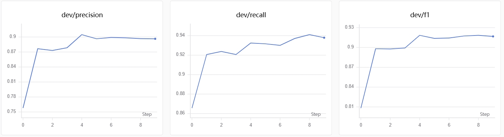
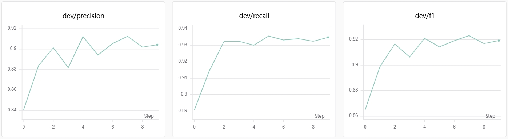
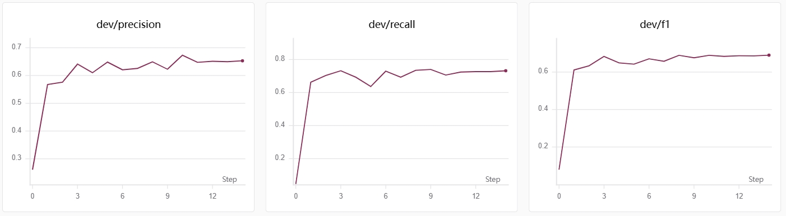
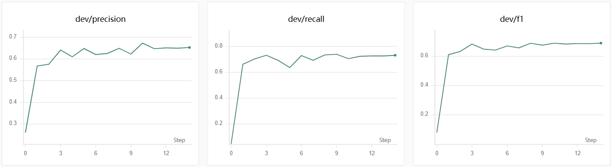

# BERT中文命名实体识别（Chinese NER Demo2）
基于预训练语言模型BERT实现中文命名实体识别任务，分别在MSRA、Weibo两份数据集完成序列标注实验，识别人名、地名、机构名等实体。

## 项目简介
本项目采用模块化面向对象设计，将数据加载、模型定义、训练评估等功能解耦封装。使用`bert-base-chinese`与`chinese‑bert‑wwm`两种中文预训练权重，采用**版本化JSON配置文件管理超参数**，通过完整的随机种子固定机制，实现稳定可复现的实验效果，对比两组预训练模型在不同数据集上的实体识别性能。

## 数据集来源
- 数据集下载链接：https://pan.baidu.com/s/10XRGQAIKGDI5eWLjmaB9Xg?pwd=1111
- 数据集：MSRA中文实体数据集、Weibo社交媒体实体数据集
- 标注格式：BIO序列标注方式
- 数据集自动划分为训练集、验证集、测试集

## 项目文件说明
| 文件名 | 作用说明 |
| :--- | :--- |
| `src/main.py` | 项目主入口，负责启动训练、验证与测试流程 |
| `src/model.py` | BERT命名实体识别模型结构定义，包含Dropout正则化 |
| `src/dataset.py` | 数据集加载与预处理，封装数据读取、BIO标签映射与编码逻辑 |
| `src/train.py` | 训练与验证逻辑，包含学习率调度、最优模型保存 |
| `src/test.py` | 独立测试脚本，加载最优权重完成测试集指标评估 |
| `src/predict.py` | 单句文本推理预测脚本，用于实体识别效果演示 |
| `src/config.py` | 配置加载模块，读取外部JSON格式实验配置 |
| `src/metrics.py` | 实体级评测模块，从BIO标签序列解析实体并计算Precision/Recall/F1，训练验证与测试共用同一套口径 |
| `configs/*.json` | 多版本实验超参数配置文件，区分不同模型与数据集 |
| `requirements.txt` | 项目依赖包清单，可通过`pip install -r requirements.txt`一键安装 |
| `checkpoints/<配置名>/` | 每组实验一个子目录，名称与 config 文件名一致，内含 `best_model.pt` / `label_list.json` / `experiment_config.json`；重复训练同一配置时自动追加时间戳新建目录，历史结果不会被覆盖 |
| `data/` | 数据集文件夹，存放MSRA、Weibo原始文本数据 |
| `assets/` | 可视化资源文件夹，存放4组实验训练曲线截图 |

## 实验结果
### 核心指标说明
本次共完成4组对照实验，评价指标采用命名实体识别标准：精确率(Precision)、召回率(Recall)、F1‑Score
- 随机种子：**101**
- 训练过程可视化：[SwanLab在线链接](https://swanlab.cn/@sunfeifei/Chinese_NER_Demo/overview)

### 四组实验完整超参数对比
| 实验编号 | 配置文件名 | 预训练模型 | 数据集 | 最大序列长度 | Batch Size | 学习率 | 训练轮数 | Weight Decay | Warmup Ratio | Dropout |
| :--- | :--- | :--- | :--- | :---: | :---: | :---: | :---: | :---: | :---: | :---: |
| 1 | 01_msra_bert_base.json | bert-base-chinese | MSRA | 128 | 8 | 2e-5 | 10 | 0.01 | 0.1 | 0.2 |
| 2 | 01_msra_bert_wwm.json | chinese-bert-wwm | MSRA | 128 | 8 | 2e-5 | 10 | 0.01 | 0.1 | 0.2 |
| 3 | 02_weibo_bert_base.json | bert-base-chinese | weibo | 128 | 8 | 2e-5 | 15 | 0.01 | 0.1 | 0.2 |
| 4 | 02_weibo_bert_wwm.json | chinese-bert-wwm | weibo | 128 | 8 | 2e-5 | 15 | 0.01 | 0.1 | 0.2 |

### 训练结果
#### 1. bert‑base‑chinese + MSRA验证集曲线（Precision & Recall & F1）

#### 2. chinese‑bert‑wwm + MSRA验证集曲线（Precision & Recall & F1）

#### 3. bert‑base‑chinese + weibo验证集曲线（Precision & Recall & F1）

#### 4. chinese‑bert‑wwm + weibo验证集曲线（Precision & Recall & F1）

## 使用方法（以01_msra_bert_base为例）
1. 安装依赖：`pip install -r requirements.txt`
2. 运行训练程序：`python src/main.py configs/01_msra_bert_base.json`
3. 独立测试评估：`python src/test.py configs/01_msra_bert_base.json`
4. 单句预测推理：`python src/predict.py --config configs/01_msra_bert_base.json --text "姚明出生于上海，任职于中国篮协"`

## 查看结果：
    训练过程会实时打印损失、验证集Precision、Recall、F1指标
    最优模型会自动保存至checkpoints对应文件夹
    训练指标实时上传SwanLab可视化平台
    测试结束后会输出完整的实体识别评估报告
